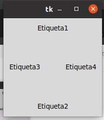
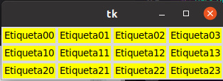
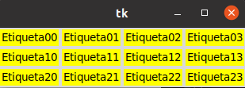
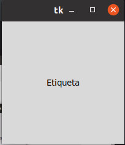

# 1. POSISONAMIENTO Y DISEÑO

##  gestor de geometria pack

### Este gestor de geometria distribuye los widgets en horizontar y vertical

## Gestor de geometria Grid
### Con Grid la distribucion de widgets se realiza de una madera mas felxible utilizando un diseño de cuadricula . De esta manera, cada widgets en la deteerminada por la intersaccion de una fila y una colunma.

## gestor de geometria place 

### este gestor permite colocar widgts en dordenadas espesificas en la ventana principal o del widgets contenedor 

