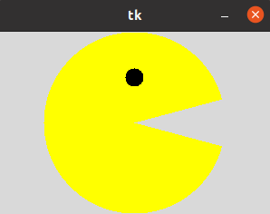
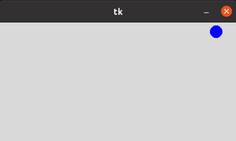
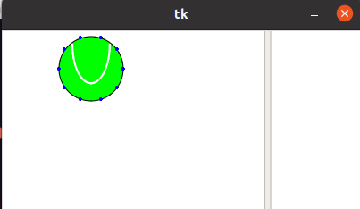
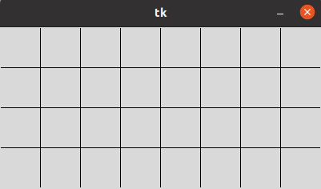
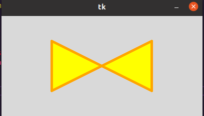
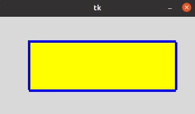
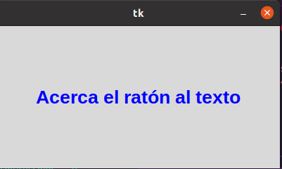
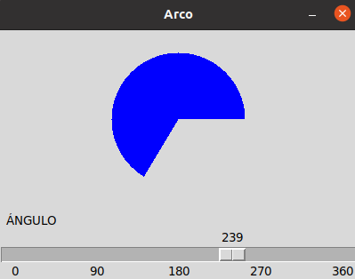

# Canvas 

## canvas arc 

### no enseña a como hacer que un circulo cambie constantemente su foma 

## canvas circulo 

### esto muestra un circulo que robota con todas las paredes de la ventana 

## canvas imagen

### nos enseña como hacer que una imagen rebote en las paredes de la ventana 

## canvas lineas 

### nos muestra como hacer lineas tanto horizontalmente como verticalmente para formar una cuadricula

##  canvas poligono 

### nos enseña a hacer figuras geometricas usando lineas 

## canvas rectangulo 

### igual que el ejemplo anterior nos muestra como hacer un rectangulo 

## canvas text

### esto lo que hace es que al poner el cursor en el texto el texto cambia de color 

## scale arco 

### esto nos permite ver como se ve un circulo con sus respectivos angulos 

