# Widgets

## button 

### esto nos muertra un temporizador e tiempo 

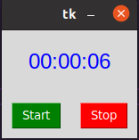

## entry 

### nos muertra como diseñar una interfas grafica donde pide nuestro usuario y contraseña 

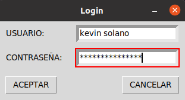

## label reloj

### esto nos muertra como hacer que en una ventana ns aparerezca el tiempo 

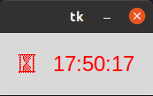

## listbox

### esto nos muertra como hacer un traductor usando palabras predeterminadas 

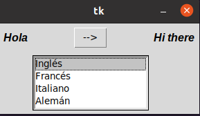

## menu 

### esto nos muestra como hacer un menu con botones despegables donde podemos elegir varias opciones 

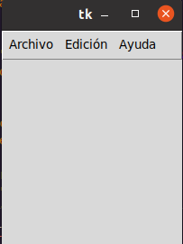

## menu button 

### esto es como una ventana donde nos pide nuestros datos mas profundos como direccion sexo ... ETC.

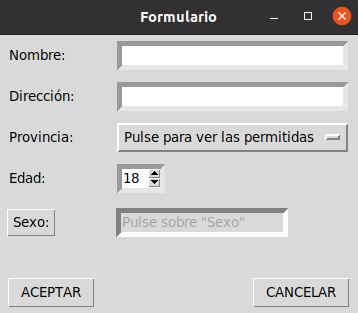

## messagebox

### nos muestra como poner mensajes en la pantala dando informacion de la app

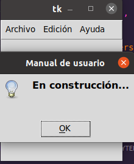

## optionmenu 

## esto es un formulario deonde debemos anotarnos

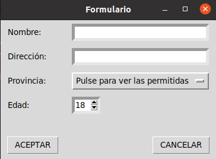

## scale_arco

### es una ventana donde podemos ver los angulos de un circuo y modificarlo como querramos 

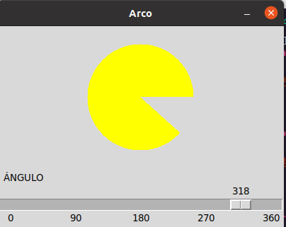

## scroll

### esto es un blog de notas donde podemos escribir todo lo que querramos 

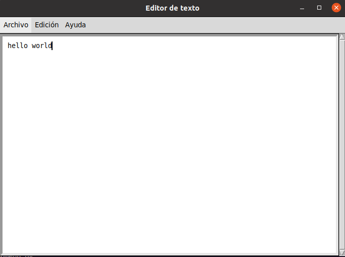

## spinbox

### es un formulario igual que los otros solo que ya no tiene la opcion de sexo 

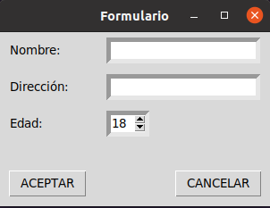

## text

### es un tablero donde podemos escribir algunas cosas que querramos 

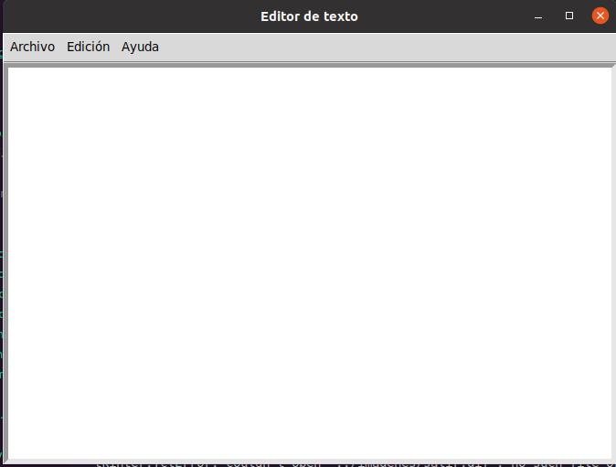